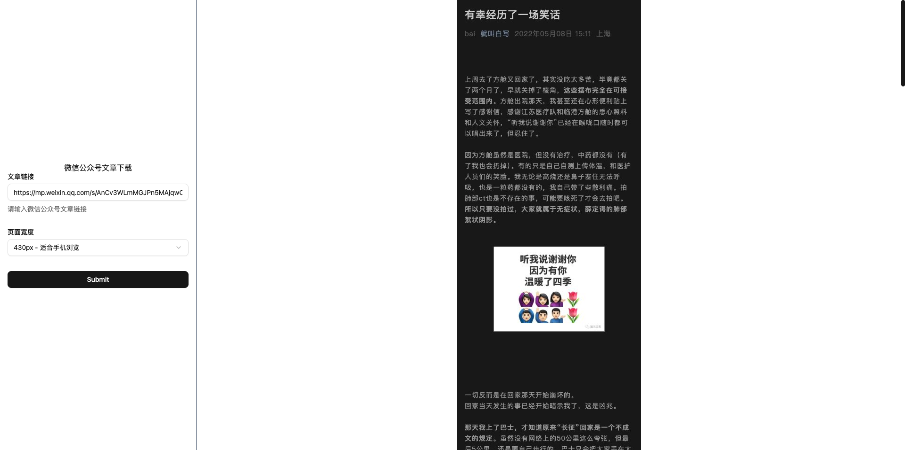

# wechat article downloader

[[EN]](./README.EN.md)


微信公众号文章下载，好文章保存到本地才是最靠谱的。

基于 [Puppeteer](https://github.com/puppeteer/puppeteer)。

## 使用

```bash
# 安装依赖
npm i

# 执行 `node index.js [公众号文章链接]`
node index.js https://mp.weixin.qq.com/s/AnCv3WLmMGJPn5MAjqwC6g
```

执行完成后，会生成 `output/[文章名].png`。



## 致谢

Stand Up For Shanghai!

## TODO

- [ ] telegram 机器人
- [ ] serverless
- [ ] 处理文章中的视频
